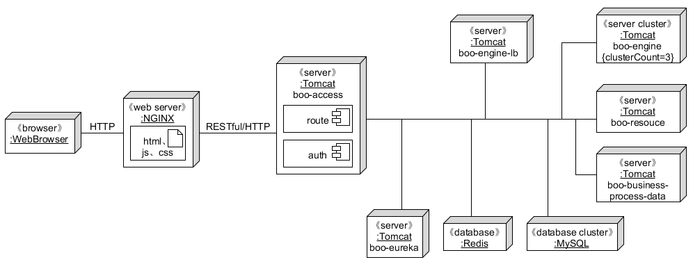

# BooWFMS

## 项目介绍

面向业务对象的多租户云业务流程管理系统。

## 项目架构

### 整体架构图

### 模块介绍

| Name                      | Features                                                     |
| ------------------------- | ------------------------------------------------------------ |
| boo-eureka-server         | [服务注册中心](https://cloud.spring.io/spring-cloud-netflix/2.2.x/reference/html/#spring-cloud-eureka-server) |
| boo-engine                | [面向业务对象的业务流程解析执行引擎](https://sysuworkflower.github.io/BOOWorkflow/) |
| boo-resource              | 负责给工作项分配资源（人力资源或计算资源）                   |
| boo-access                | [鉴权与网关](https://cloud.spring.io/spring-cloud-netflix/2.2.x/reference/html/#router-and-filter-zuul) |
| boo-engine-lb             | 解析执行引擎负载均衡器                                       |
| boo-business-process-data | 业务流程相关数据读写                                         |
| boo-common                | 项目基础包                                         |
| boo-activiti-engine       | 无状态工作流引擎Activiti                                     |
| boo-activiti-process-execution       | 无状态云工作流系统准入和调度模块                                     |